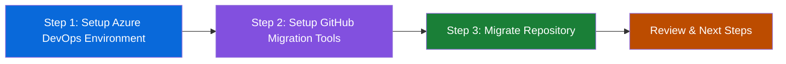

## Step 1: Setting up your Azure DevOps Environment

Welcome to the Azure DevOps to GitHub migration exercise! In this hands-on workshop, you'll learn how to migrate repositories from Azure DevOps to GitHub using GitHub's official migration tools.



To practice migrating from Azure DevOps to GitHub, you need a realistic source environment. We will ask you to use a Personal Access Token to authenticate with Azure DevOps and the provided script that will automatically build a complete project environment.

This approach simulates real-world migration scenarios where you have existing Azure DevOps projects with:

- Sample repository with code, commits, and branches
- Work items (user stories, tasks, bugs)
- Project settings and configurations

### ⌨️ Activity: Login to Codespace

Let's start up our project environment. This lab will be ran entirely from within a GitHub Codespace.

1. Use the below button to open the **Create Codespace** page in a new tab. Use the default configuration.

   [](https://codespaces.new/{{full_repo_name}}?quickstart=1)

1. Wait a moment for Visual Studio Code to fully load in your browser. This can take a minute or two.

### ⌨️ Activity: Create Azure DevOps Personal Access Token

1. Navigate to your Azure DevOps organization in a new browser tab.
1. Click on `User Settings` in top right corner, next to your profile picture.
1. Select `Personal access tokens` from the dropdown menu.
1. Click `New Token` to create a new personal access token.
1. Give your token a descriptive name (e.g., `Migration Exercise`).
1. Under `Scopes`, select `Full access`
   > ⚠️ **Warning:** Note for myself, update this to minimum permission before releasing exercise.
1. Click `Create` and copy the generated token.
1. Store the token securely as you won't be able to see it again.

### ⌨️ Activity: Create Mock Azure Project

Now it's time to use that token to create a mock ADO project that we will migrate to GitHub in the next steps!

1. First, configure your Azure DevOps organization URL by opening the config file `ado/config.yml` in VS Code.

1. Update the `ado_url` value with your Azure DevOps organization URL (e.g., `https://dev.azure.com/your-org`):

1. Run the bootstrap script with your Azure DevOps information. This will source information from the config file and run a terraform script.

   ```bash
   ./ado/bootstrap.sh --ado-token "YOUR_TOKEN_HERE"
   ```

1. Watch the script output as it initializes and applies the Terraform configuration.
1. Wait for the script to complete successfully.

<details>
<summary>Having trouble? 🤷</summary><br/>

- Double-check that your token and organization URL are correct
- If you get permission errors, verify your token has the right scopes and run the command again

</details>
